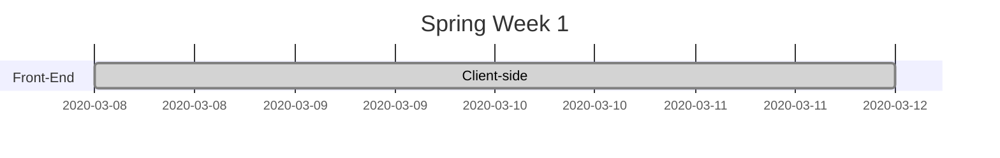
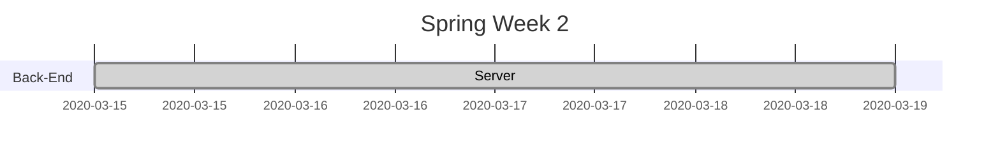

---
# Donator

By: @92yo, @francisA2000, @LinaQh92

---

## About 

A place which makes your life a bit more easy when doing a good deed. Stop worrying about when and where and start looking for what to donate, and let us do the rest.

---

## Table of Contents

Open [Donator](https://donator.netlify.com) to view it in the browser.	

* [TOC]
* 
---

## :page_with_curl: Overview


We Focused on a problem that we see in our communities today, where people have no time to deliver or find an organization to donate various household things to, such as clothes/resources etc.
This website will make it easier for them to donate clothes without the hassle of worrying about finding time to give it to the orgs.

---

## :floppy_disk::package: Installing locally 

1. clone this rep.
2. cd into the cloned rep.
3. In the terminal run: npm i
4. In the terminal run: npm start
5. The server is now running at localhost:3000
6. Open localhost:3000 in your browser!

---

User story
---

```gherkin=
Feature: Donate Your Old Clothes/Resources

  # The first step 
  Scenario: User Reads the front page - 
    user watches video 
    and discover which orgs we     work with 
    and who are we.
    
    When the User clicks sign-up he's redirected 
    to the sign up page
    
    Then the User Puts in his details

  # The second Step has three steps
  Scenario: User Clicks on Donate now - afte he reads about the orgs
    Given the User has clicked donate now - is redirected to the donation page
    
    When the User sees the Donation page he has three steps to go over: 
    1) what to donate - and which org to donate to
    
    2) which time the delivery driver can come pick up his donation
    
    3) has an option to include any additional info
    
    Then the User clicks Donate at the last step to process his request
```

> I choose a lazy person to do a hard job. Because a lazy person will find an easy way to do it. [name=Bill Gates]


```gherkin=
Feature: Profile Page - Statistics

  As a User 
  I want to change my details and see how many times i donated to the specific org- 
  i click on my profile - i have an option to edit and change any given info.

  Scenario: User click statistics Tab
  
    Given I'm a logged-in User
    
    When I go to the Statistic tab
    
    Then the amount of times i donated to the specific org i chose is shown
    
    And my subtotal should increment everytime i donate to the same org
    
```


Project Timeline
---




## [Go To Donator Server](https://github.com/FACN8/Donator-server)


